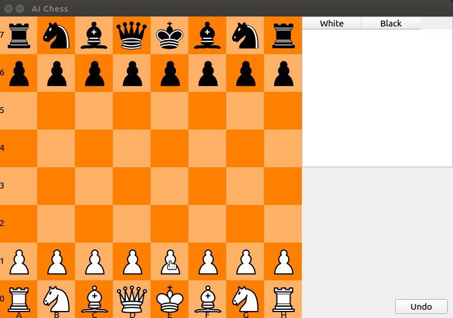

# Chess with Alpha-Beta Pruning Opponent

[](https://travis-ci.org/joemccann/dillinger) [](https://www.gnu.org/licenses/gpl-3.0)

## Overview
This repository contains the chess game with some simple AI. [Alpha-Beta Puring](https://en.wikipedia.org/wiki/Alpha%E2%80%93beta_pruning) algorithm was used to decide the movement.



## Requirements
This repository requires to [**Qt-5**](https://doc.qt.io/qt-5/gettingstarted.html) installation.

## Installation
You can clone this repo with following command.
```sh
$ git clone https://github.com/Kadiryanik/AI-Chess
```
## Compile&Run
 - You can simply open project in **Qt Creator** and select *AI-Chess.pro* file and press **Ctrl** + **R**.

## Todos
 - *Mark pawn when 2 box forwarded for be edible*
 - *Add castling move*
 - *Improve rating*
 - *Improve notation*

## Maintainer
 - **Kadir Yanık** - _kdrynkk@gmail.com_  

**Free Software, Hell Yeah!**
